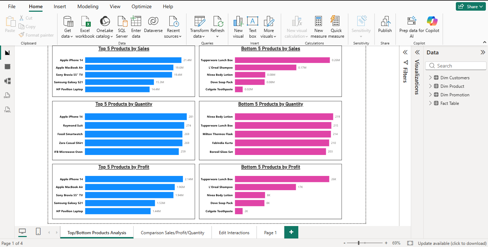
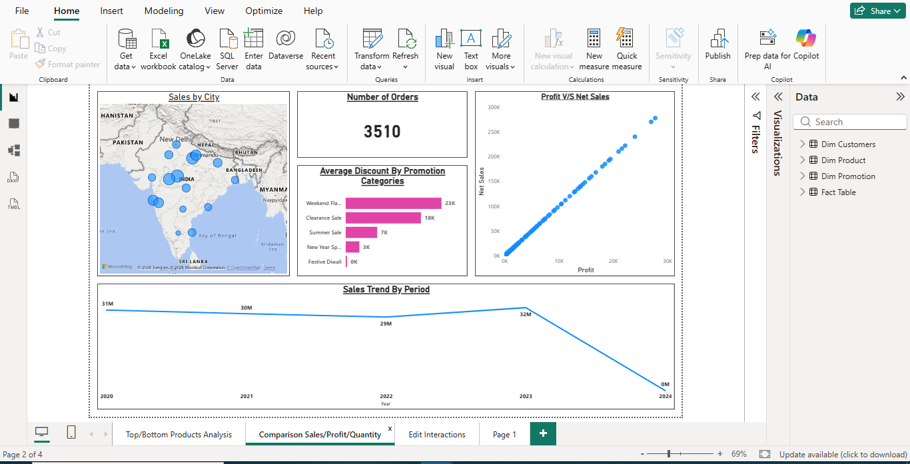
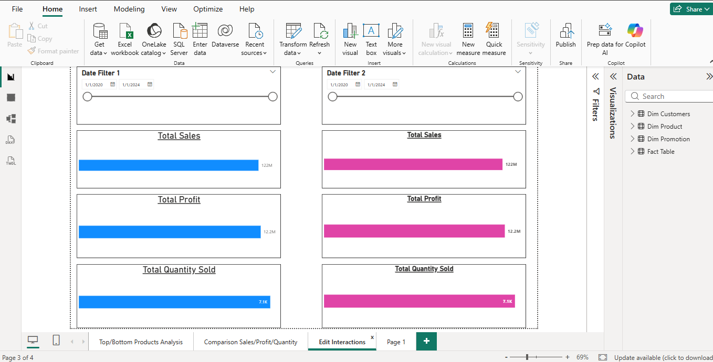
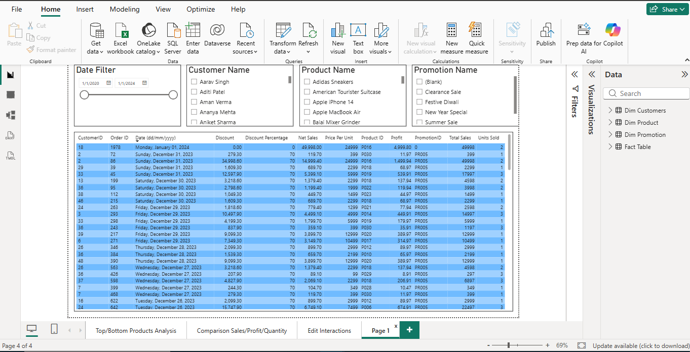

# Sales Analytics Dashboard

## Project Overview

This Power BI dashboard provides comprehensive sales performance analysis across products, customers, cities, and promotional campaigns. The project leverages a Star Schema data model and interactive visualizations to support business decision-making.

## Tools & Technologies

* Power BI
* Power Query
* DAX
* SQL
* Excel
* Data Modeling
* Data Visualization

## Data Model

The project follows a Star Schema architecture:

* Fact Table
* Dim Customers
* Dim Product
* Dim Promotion

## Key Business KPIs

* Total Sales: 122M
* Total Profit: 12.2M
* Total Quantity Sold: 7.1K
* Number of Orders: 3510

## Dashboard Screenshots

### Product Analysis

### Dashboard Overview

### Sales Comparison

### Data Explorer

## Author

**Shubhender Kumar**

Senior Quality Analyst | Aspiring Data Analyst

Skills: SQL | Power BI | DAX | Python | Excel
